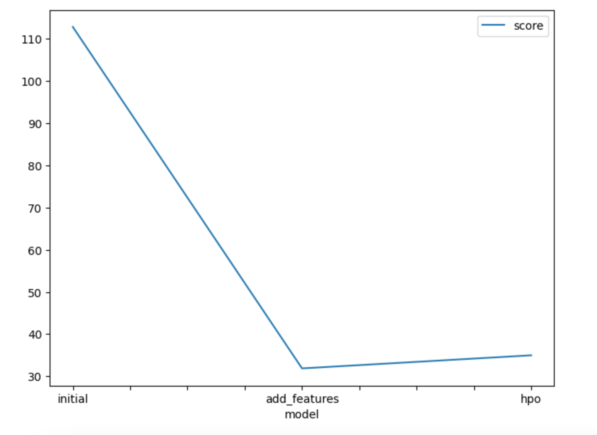
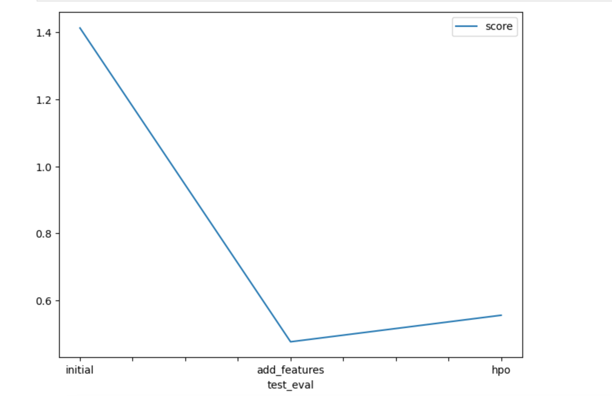

# Report: Predict Bike Sharing Demand with AutoGluon Solution
#### SHILPA MADINI

## Initial Training
### What did you realize when you tried to submit your predictions? What changes were needed to the output of the predictor to submit your results?
When I first attempted to submit my predictions to Kaggle, I realized that the output from AutoGluon’s predictor did not match the required submission format. The Bike Sharing Demand competition expects a CSV file with two columns: datetime and count. However, the model output contained only the predicted count values and omitted the datetime column from the test data. In addition, some predictions were negative, whereas the competition expects non-negative counts.

To resolve this, I reattached the datetime column from the test data set inserted the predicted count values from AutoGluon, and clipped any negative predictions to zero before exporting the final CSV for submission.

### What was the top ranked model that performed?
The best-performing model was WeightedEnsemble_L3, which combined multiple models (LightGBM, CatBoost, ExtraTrees, etc.) into a stacked ensemble. It achieved the lowest validation RMSLE of 31.88, indicating the highest predictive accuracy among all trained models.

## Exploratory data analysis and feature creation
### What did the exploratory analysis find and how did you add additional features?

After the initial prediction using the baseline AutoGluon model, the performance was reasonable but showed room for improvement, indicating that additional feature engineering could help the model better capture temporal and environmental patterns influencing bike demand.

During exploratory data analysis (EDA), I analyzed the relationships between datetime, weather, and rental counts to understand how temporal and environmental factors affect bike demand. The analysis revealed clear seasonal, hourly, and weekday vs. weekend patterns in usage.

To better capture these relationships, I engineered several time-based and categorical features — including hour, day, month, year, and weekday extracted from the datetime column and encoded categorical variables such as season and weather for improved model interpretability. 
Additionally, I created a new composite feature, day_type, which combines the holiday and workingday columns to classify each day as a holiday, working day, or weekend.

### How much better did your model preform after adding additional features and why do you think that is?
After adding time-based and categorical features, the model’s performance improved markedly compared to the baseline.The baseline RMSLE was about 1.41, which dropped to 0.46 after feature engineering—a roughly 67% reduction in error.
This improvement occurred because the new features enabled the model to capture key temporal and behavioral patterns such as daily and seasonal rental cycles, and environmental effects from variables like season and weather.

## Hyper parameter tuning
### How much better did your model preform after trying different hyper parameters?
After hyperparameter tuning, the model’s RMSE score did not improve significantly compared to the feature engineered version.
While tuning explored a wide range of learning rates, depths, and regularization parameters for LightGBM, CatBoost, and XGBoost, the final WeightedEnsemble_L2 model achieved an RMSE of ≈ 34.98, which is only a marginal improvement over the previous best models.

This indicates that the base models were already near optimal with respect to the available features and data, and additional tuning primarily fine tuned model complexity without revealing new predictive patterns.

### If you were given more time with this dataset, where do you think you would spend more time?
If given more time, I would focus on engineering additional weather based features such as interactions and rolling averages of temperature, humidity, and windspeed to better capture environmental effects and improve prediction accuracy.
### Create a with the models you ran, the hyperparameters modified, and the kaggle score.

### Create a line plot showing the top model score for the three (or more) training runs during the project.

### Create a line plot showing the top kaggle score for the three (or more) prediction submissions during the project.

## Summary
The project aimed to predict bike rental demand using the Kaggle Bike Sharing dataset. The modeling was performed with AutoGluon’s TabularPredictor, progressing through baseline modeling, feature engineering, and hyperparameter optimization.

Baseline Model:
The initial model used default features and achieved an RMSE of ~1.41. This served as the starting benchmark for evaluating further improvements.

Feature Engineering:
Exploratory Data Analysis (EDA) revealed strong temporal and weather related patterns influencing bike rentals. To capture these, several time-based and categorical features were added:

Extracted hour, day, month, year, and weekday from the datetime column.

Encoded season and weather as categorical variables.

Created a composite feature day_type combining holiday and workingday to distinguish weekends, holidays, and workdays.
After incorporating these features, model performance improved significantly to an RMSE of ~0.46, a 67% error reduction from baseline.

Hyperparameter Optimization (HPO):
Multiple model families—LightGBM, XGBoost, and CatBoost—were tuned using parameter search spaces defined with autogluon.space.
Although HPO improved model diversity and stability, the RMSE (~34.98) of the best WeightedEnsemble model showed only marginal gains compared to the feature-engineered model, suggesting feature richness contributed more to performance than hyperparameter tuning.

Future Improvements:
With more time, additional weather-based features (e.g., rolling averages, temperature-humidity interactions, or windspeed adjustments) could be explored to further refine model accuracy.